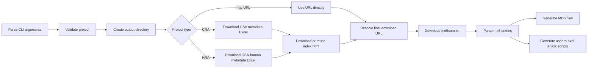

# run_get_gsa_infor.py

Repository manual for downloading GSA/GSA-human project metadata, checksum files, and download helper scripts.

**Language:** [中文](#中文版本) | [English](#english-version)

---

## Repository Contents

- [中文版本](#中文版本)
- [English Version](#english-version)

---

<a id="中文版本"></a>

## 中文版本

[English Version](#english-version) | [Repository Contents](#repository-contents)

### 目录

- [脚本概览](#脚本概览)
- [快速开始](#快速开始)
- [命令行参数](#命令行参数)
- [工作流程](#工作流程)
- [流程图](#流程图)
- [函数参考](#函数参考)
- [输入输出文件](#输入输出文件)
- [文件内容示例](#文件内容示例)
- [使用注意事项](#使用注意事项)
- [常见问题](#常见问题)
- [测试建议](#测试建议)

<a id="脚本概览"></a>

### 脚本概览 [English](#overview)

`run_get_gsa_infor.py` 用于下载 GSA/GSA-human 项目的 metadata Excel、browse 页面 HTML 和 `md5sum.txt`，并根据 md5 条目生成 MD5 校验文件以及 aspera、axel、aria2c 下载脚本。

| 项目 | 内容 |
| --- | --- |
| 脚本文件 | `run_get_gsa_infor.py` |
| 支持环境 | Python 3.6+ |
| 外部依赖 | 无，仅使用 Python 标准库 |
| 当前支持输入 | `HRA`、`CRA`、完整 `http` URL |
| 默认输出目录 | `gsa_info_sample_<project_basename>` |

<a id="快速开始"></a>

### 快速开始 [English](#quick-start)

```bash
python run_get_gsa_infor.py -p HRA000425
python run_get_gsa_infor.py -p CRA000112
python run_get_gsa_infor.py -p https://download.cncb.ac.cn/gsa/CRA000112/
```

指定输出目录：

```bash
python run_get_gsa_infor.py -p HRA000425 -o ./gsa_info_sample_HRA000425
```

强制刷新缓存文件：

```bash
python run_get_gsa_infor.py -p HRA000425 -o ./gsa_info_sample_HRA000425 --force
```

查看帮助：

```bash
python run_get_gsa_infor.py -h
```

<a id="命令行参数"></a>

### 命令行参数 [English](#cli-options)

| 参数 | 是否必需 | 默认值 | 说明 | 示例 |
| --- | --- | --- | --- | --- |
| `-p`, `--project` | 是 | 无 | 项目编号或完整下载 URL。当前仅支持 `HRA`、`CRA` 或 `http` 开头的输入。 | `HRA000425` |
| `-o`, `--outdir` | 否 | `gsa_info_sample_<project_basename>` | 输出目录。目录不存在时自动创建。 | `-o ./result` |
| `--force` | 否 | `False` | 强制重新下载已缓存的 HTML、Excel、`url.txt` 和 `md5sum.txt`。 | `--force` |

参数对象示例：

```json
{
  "project": "HRA000425",
  "outdir": "gsa_info_sample_HRA000425",
  "force": false
}
```

<a id="工作流程"></a>

### 工作流程 [English](#workflow)

脚本主流程由 `run_workflow()` 调度：

1. 解析命令行参数。
2. 校验项目编号或 URL。
3. 创建输出目录。
4. 根据项目类型下载 metadata Excel。
5. 下载或复用 browse 页面 HTML。
6. 获取最终数据下载根 URL，并缓存到 `url.txt`。
7. 下载 `md5sum.txt`。
8. 解析全部 md5 条目，并筛选 FASTQ 条目。
9. 生成 `MD5_all.txt`、可选的 `MD5.txt` 以及下载脚本。

项目类型处理逻辑：

| 输入类型 | metadata Excel | browse HTML | 最终 URL | 备注 |
| --- | --- | --- | --- | --- |
| `CRA000112` | 通过 GSA 接口 POST 下载 | 下载 `https://ngdc.cncb.ac.cn/gsa/browse/<project>` | 从 HTML 中解析唯一 download URL | 普通 GSA 项目 |
| `HRA000425` | 提取 `study_id` 后下载 | 下载 `https://ngdc.cncb.ac.cn/gsa-human/browse/<project>` | 拼接 `https://download.cncb.ac.cn/gsa-human/<project>` | GSA-human 项目 |
| `https://...` | 不下载 | 不下载 | 直接使用输入 URL | 适合已知下载根目录 |

<a id="流程图"></a>

### 流程图 [English](#flowchart)



<a id="函数参考"></a>

### 函数参考 [English](#function-reference)

| 函数 | 输入 | 输出 | 功能 |
| --- | --- | --- | --- |
| `parse_args()` | 命令行参数 | `argparse.Namespace` | 解析 `-p`、`-o`、`--force`。 |
| `validate_project(project)` | 项目编号或 URL | `None` | 检查输入是否为 `HRA`、`CRA` 或 `http` 开头。 |
| `project_basename(project)` | 项目编号或 URL | 字符串 | 提取项目基名，用于默认输出目录。 |
| `ensure_dir(path)` | 目录路径 | `None` | 创建输出目录。 |
| `fetch_url(...)` | URL、输出文件、HTTP 参数 | 文件 | 下载 URL 内容到本地文件。 |
| `download_html(project, workdir, force)` | 项目编号、输出目录 | `index.html` 路径 | 下载 CRA/HRA browse 页面。 |
| `download_meta_gsa(project, workdir, force)` | CRA 编号 | Excel 文件 | 下载 GSA metadata Excel。 |
| `download_meta_gsa_human(project, workdir, force)` | HRA 编号 | Excel 文件 | 提取 `study_id` 后下载 GSA-human metadata Excel。 |
| `find_hra_study_id(html_text)` | HTML 文本 | `study_id` | 从 GSA-human HTML 中提取 study ID。 |
| `find_download_url_from_html(project, html_text)` | CRA 编号、HTML 文本 | 下载 URL | 从 CRA browse HTML 中提取唯一 download URL。 |
| `get_download_url(project, workdir, force)` | 项目或 URL、输出目录 | 最终下载根 URL | 读取或生成 `url.txt`。 |
| `parse_md5sum(md5sum_file, project_base)` | md5sum 文件、项目基名 | `(md5, path)` 列表 | 解析 md5sum 条目并裁剪项目名前缀。 |
| `write_md5_file(entries, output_file)` | md5 条目、输出路径 | MD5 文件 | 写出 `md5<TAB>filename` 格式。 |
| `aspera_base_url(url)` | HTTPS URL | Aspera 远程路径 | 把 HTTPS 根 URL 转成 Aspera 命令使用的远程路径。 |
| `write_download_scripts(entries, url, workdir, prefix)` | md5 条目、URL、输出目录、前缀 | Shell 脚本 | 生成 aspera、axel、aria2c 下载脚本。 |
| `run_workflow(args)` | 参数对象 | 输出目录文件 | 执行完整工作流。 |
| `main()` | 无 | 退出码 | 捕获异常并返回 `0` 或 `1`。 |

<a id="输入输出文件"></a>

### 输入输出文件 [English](#input-and-output-files)

输入来源：

| 输入 | 格式 | 来源 | 说明 |
| --- | --- | --- | --- |
| 项目编号 | `HRA000425` 或 `CRA000112` | 用户参数 | 通过 `-p/--project` 传入。 |
| 完整 URL | `https://download.cncb.ac.cn/gsa/CRA000112/` | 用户参数 | 直接作为下载根 URL 使用。 |
| `index.html` | HTML | 脚本下载或缓存 | 用于提取 `study_id` 或 CRA 下载 URL。 |
| `md5sum.txt` | 两列文本：md5、路径 | 脚本下载 | 用于生成 MD5 文件和下载脚本。 |

输出文件：

| 文件 | 格式 | 生成条件 | 用途 |
| --- | --- | --- | --- |
| `<project>.xlsx` | Excel | 输入为 CRA/HRA 编号 | 项目 metadata 信息表。 |
| `index.html` | HTML | 输入为 CRA/HRA 编号 | browse 页面缓存。 |
| `url.txt` | 一行 URL | 总是生成 | 缓存最终下载根 URL。 |
| `md5sum.txt` | 两列文本 | 总是下载 | 远程原始 md5 文件。 |
| `MD5_all.txt` | `md5<TAB>filename` | 总是生成 | 全部文件校验表。 |
| `MD5.txt` | `md5<TAB>filename` | 存在 FASTQ 时生成 | FASTQ 文件校验表。 |
| `run_download_all_files_using_aspera.sh` | Shell script | 总是生成 | Aspera 下载全部文件。 |
| `run_download_all_files_using_axel.sh` | Shell script | 总是生成 | Axel 下载全部文件。 |
| `run_download_all_files_using_aria2c.sh` | Shell script | 总是生成 | aria2c 下载全部文件。 |
| `run_download_fastq_using_aspera.sh` | Shell script | 存在 FASTQ 时生成 | Aspera 下载 FASTQ。 |
| `run_download_fastq_using_axel.sh` | Shell script | 存在 FASTQ 时生成 | Axel 下载 FASTQ。 |
| `run_download_fastq_using_aria2c.sh` | Shell script | 存在 FASTQ 时生成 | aria2c 下载 FASTQ。 |

<a id="文件内容示例"></a>

### 文件内容示例 [English](#file-examples)

`url.txt`：

```text
https://download.cncb.ac.cn/gsa-human/HRA000425
```

`MD5.txt`：

```text
8a6ca074fca78a1eb0d41050c1f9ac7f	HRR165454_f1.fastq.gz
557a4d37e4ba3e6112abf40f1f8e34be	HRR165454_r2.fastq.gz
dd951bd8c5b7bc111ddb813afef6ab40	HRR165455_f1.fastq.gz
71774e5ecfdeb0ac5796dc663c59cba3	HRR165455_r2.fastq.gz
cb16fe169d7d979154c5a537302f6029	HRR165456_f1.fastq.gz
```

`run_download_fastq_using_aria2c.sh`：

```bash
aria2c -c -j 16 -x 16 -s 16 https://download.cncb.ac.cn/gsa-human/HRA000425/HRR165454/HRR165454_f1.fastq.gz
aria2c -c -j 16 -x 16 -s 16 https://download.cncb.ac.cn/gsa-human/HRA000425/HRR165454/HRR165454_r2.fastq.gz
aria2c -c -j 16 -x 16 -s 16 https://download.cncb.ac.cn/gsa-human/HRA000425/HRR165455/HRR165455_f1.fastq.gz
```

日志片段：

```text
2026-05-26 10:10:51 INFO: Argument values: {'project': 'HRA000425', 'outdir': 'gsa_info_sample_HRA000425', 'force': False}
2026-05-26 10:10:51 INFO: Starting ...
2026-05-26 10:10:51 INFO: Final URL: https://download.cncb.ac.cn/gsa-human/HRA000425
2026-05-26 10:10:51 INFO: Loaded md5 entries: all=109, fastq=80
2026-05-26 10:10:51 INFO: Done
```

<a id="使用注意事项"></a>

### 使用注意事项 [English](#usage-notes)

- 当前脚本只支持 `HRA`、`CRA` 和完整 `http` URL。`XDA`、`XDB` 等编号不会通过入口校验。
- 默认会复用已有非空缓存文件，包括 `index.html`、`.xlsx`、`url.txt` 和 `md5sum.txt`。需要重新下载时使用 `--force`。
- HRA 项目页面中如果包含 `Controlled access`，脚本会打印 warning 并以 `0` 状态退出。
- Aspera 下载脚本依赖 `~/.aspera/connect/etc/aspera01.openssh`。如果 key 文件不存在，脚本会记录提示信息，但仍会生成下载脚本。
- `MD5.txt` 和 `MD5_all.txt` 的第二列只保留文件名，不保留原始目录路径，适合把校验文件和下载后的数据文件放在同一目录下使用。
- FASTQ 文件筛选条件为路径以 `q.gz` 结尾。

<a id="常见问题"></a>

### 常见问题 [English](#troubleshooting)

| 问题 | 可能原因 | 处理建议 |
| --- | --- | --- |
| `The project id must start with 'HRA', 'CRA', or 'http'` | 输入编号不受支持。 | 使用 HRA/CRA 编号，或传入完整下载 URL。 |
| `cannot find a unique download URL` | CRA browse 页面中没有唯一 download URL。 | 使用 `--force` 重新下载 HTML；检查 `index.html`。 |
| `md5sum.txt` 返回 404 | 最终 URL 不是实际数据根目录。 | 查看 `url.txt` 并确认远程目录结构。 |
| 没有生成 FASTQ 下载脚本 | `md5sum.txt` 中没有以 `q.gz` 结尾的文件。 | 查看 `MD5_all.txt` 中的文件后缀。 |
| Aspera 脚本无法运行 | 缺少 Aspera 客户端或 key 文件。 | 安装 Aspera Connect，并按日志提示下载 key。 |

<a id="测试建议"></a>

### 测试建议 [English](#suggested-tests)

语法检查：

```bash
python -m py_compile run_get_gsa_infor.py
```

帮助信息：

```bash
python run_get_gsa_infor.py -h
```

使用已有缓存目录进行 smoke test：

```bash
python run_get_gsa_infor.py -p HRA000425 -o gsa_info_sample_HRA000425
python run_get_gsa_infor.py -p CRA000112 -o gsa_info_sample_CRA000112
```

下载后校验：

```bash
cd gsa_info_sample_HRA000425
md5sum -c MD5.txt
md5sum -c MD5_all.txt
```

[返回中文目录](#目录) | [English Version](#english-version) | [Repository Contents](#repository-contents)

---

<a id="english-version"></a>

## English Version

[中文版本](#中文版本) | [Repository Contents](#repository-contents)

### Table of Contents

- [Overview](#overview)
- [Quick Start](#quick-start)
- [CLI Options](#cli-options)
- [Workflow](#workflow)
- [Flowchart](#flowchart)
- [Function Reference](#function-reference)
- [Input and Output Files](#input-and-output-files)
- [File Examples](#file-examples)
- [Usage Notes](#usage-notes)
- [Troubleshooting](#troubleshooting)
- [Suggested Tests](#suggested-tests)

<a id="overview"></a>

### Overview [中文](#脚本概览)

`run_get_gsa_infor.py` downloads metadata Excel files, browse-page HTML, and `md5sum.txt` files for GSA/GSA-human projects. It then generates MD5 checksum files and helper scripts for aspera, axel, and aria2c downloads.

| Item | Value |
| --- | --- |
| Script | `run_get_gsa_infor.py` |
| Runtime | Python 3.6+ |
| Dependencies | Python standard library only |
| Supported input | `HRA`, `CRA`, full `http` URL |
| Default output directory | `gsa_info_sample_<project_basename>` |

<a id="quick-start"></a>

### Quick Start [中文](#快速开始)

```bash
python run_get_gsa_infor.py -p HRA000425
python run_get_gsa_infor.py -p CRA000112
python run_get_gsa_infor.py -p https://download.cncb.ac.cn/gsa/CRA000112/
```

Specify an output directory:

```bash
python run_get_gsa_infor.py -p HRA000425 -o ./gsa_info_sample_HRA000425
```

Force refresh cached files:

```bash
python run_get_gsa_infor.py -p HRA000425 -o ./gsa_info_sample_HRA000425 --force
```

Show help:

```bash
python run_get_gsa_infor.py -h
```

<a id="cli-options"></a>

### CLI Options [中文](#命令行参数)

| Option | Required | Default | Description | Example |
| --- | --- | --- | --- | --- |
| `-p`, `--project` | Yes | None | Project ID or full download URL. Only `HRA`, `CRA`, and `http` inputs are supported. | `HRA000425` |
| `-o`, `--outdir` | No | `gsa_info_sample_<project_basename>` | Output directory. It is created automatically when missing. | `-o ./result` |
| `--force` | No | `False` | Redownload cached HTML, Excel, `url.txt`, and `md5sum.txt`. | `--force` |

Example argument object:

```json
{
  "project": "HRA000425",
  "outdir": "gsa_info_sample_HRA000425",
  "force": false
}
```

<a id="workflow"></a>

### Workflow [中文](#工作流程)

The main workflow is orchestrated by `run_workflow()`:

1. Parse CLI arguments.
2. Validate the project ID or URL.
3. Create the output directory.
4. Download metadata Excel according to project type.
5. Download or reuse the browse-page HTML.
6. Resolve the final data download root URL and cache it in `url.txt`.
7. Download `md5sum.txt`.
8. Parse all md5 entries and select FASTQ entries.
9. Generate `MD5_all.txt`, optional `MD5.txt`, and download helper scripts.

Project-type behavior:

| Input Type | Metadata Excel | Browse HTML | Final URL | Notes |
| --- | --- | --- | --- | --- |
| `CRA000112` | POST to the GSA export endpoint | Download `https://ngdc.cncb.ac.cn/gsa/browse/<project>` | Extract a unique download URL from HTML | Standard GSA project |
| `HRA000425` | Extract `study_id`, then download Excel | Download `https://ngdc.cncb.ac.cn/gsa-human/browse/<project>` | Build `https://download.cncb.ac.cn/gsa-human/<project>` | GSA-human project |
| `https://...` | Skipped | Skipped | Use the input URL directly | Useful when the download root is already known |

<a id="flowchart"></a>

### Flowchart [中文](#流程图)


<a id="function-reference"></a>

### Function Reference [中文](#函数参考)

| Function | Input | Output | Purpose |
| --- | --- | --- | --- |
| `parse_args()` | CLI arguments | `argparse.Namespace` | Parse `-p`, `-o`, and `--force`. |
| `validate_project(project)` | Project ID or URL | `None` | Accept only `HRA`, `CRA`, or `http` inputs. |
| `project_basename(project)` | Project ID or URL | string | Extract a stable project basename for the default output directory. |
| `ensure_dir(path)` | Directory path | `None` | Create the output directory. |
| `fetch_url(...)` | URL, output file, HTTP options | File | Download URL content to a local file. |
| `download_html(project, workdir, force)` | Project ID and output directory | `index.html` path | Download the CRA/HRA browse page. |
| `download_meta_gsa(project, workdir, force)` | CRA ID | Excel file | Download GSA metadata Excel. |
| `download_meta_gsa_human(project, workdir, force)` | HRA ID | Excel file | Extract `study_id` and download GSA-human metadata Excel. |
| `find_hra_study_id(html_text)` | HTML text | `study_id` | Extract study ID from GSA-human HTML. |
| `find_download_url_from_html(project, html_text)` | CRA ID and HTML text | Download URL | Extract a unique download URL from CRA browse HTML. |
| `get_download_url(project, workdir, force)` | Project or URL and output directory | Final download root URL | Read or generate `url.txt`. |
| `parse_md5sum(md5sum_file, project_base)` | md5sum file and project basename | list of `(md5, path)` | Parse md5sum entries and trim the project prefix. |
| `write_md5_file(entries, output_file)` | md5 entries and output path | MD5 file | Write `md5<TAB>filename` records. |
| `aspera_base_url(url)` | HTTPS URL | Aspera remote path | Convert an HTTPS root URL to an Aspera remote path. |
| `write_download_scripts(entries, url, workdir, prefix)` | md5 entries, URL, directory, prefix | Shell scripts | Generate aspera, axel, and aria2c scripts. |
| `run_workflow(args)` | argument object | output files | Execute the full workflow. |
| `main()` | none | exit code | Catch errors and return `0` or `1`. |

<a id="input-and-output-files"></a>

### Input and Output Files [中文](#输入输出文件)

Inputs:

| Input | Format | Source | Description |
| --- | --- | --- | --- |
| Project ID | `HRA000425` or `CRA000112` | User argument | Passed via `-p/--project`. |
| Full URL | `https://download.cncb.ac.cn/gsa/CRA000112/` | User argument | Used directly as the download root URL. |
| `index.html` | HTML | Downloaded or cached by the script | Used to extract `study_id` or the CRA download URL. |
| `md5sum.txt` | Two-column text: md5 and path | Downloaded by the script | Used to generate MD5 files and download scripts. |

Outputs:

| File | Format | Condition | Purpose |
| --- | --- | --- | --- |
| `<project>.xlsx` | Excel | CRA/HRA project ID | Project metadata table. |
| `index.html` | HTML | CRA/HRA project ID | Cached browse page. |
| `url.txt` | One-line URL | Always generated | Cached final download root URL. |
| `md5sum.txt` | Two-column text | Always downloaded | Original remote md5 file. |
| `MD5_all.txt` | `md5<TAB>filename` | Always generated | Checksum file for all files. |
| `MD5.txt` | `md5<TAB>filename` | Generated when FASTQ exists | Checksum file for FASTQ files. |
| `run_download_all_files_using_aspera.sh` | Shell script | Always generated | Download all files with Aspera. |
| `run_download_all_files_using_axel.sh` | Shell script | Always generated | Download all files with Axel. |
| `run_download_all_files_using_aria2c.sh` | Shell script | Always generated | Download all files with aria2c. |
| `run_download_fastq_using_aspera.sh` | Shell script | Generated when FASTQ exists | Download FASTQ files with Aspera. |
| `run_download_fastq_using_axel.sh` | Shell script | Generated when FASTQ exists | Download FASTQ files with Axel. |
| `run_download_fastq_using_aria2c.sh` | Shell script | Generated when FASTQ exists | Download FASTQ files with aria2c. |

<a id="file-examples"></a>

### File Examples [中文](#文件内容示例)

`url.txt`:

```text
https://download.cncb.ac.cn/gsa-human/HRA000425
```

`MD5.txt`:

```text
8a6ca074fca78a1eb0d41050c1f9ac7f	HRR165454_f1.fastq.gz
557a4d37e4ba3e6112abf40f1f8e34be	HRR165454_r2.fastq.gz
dd951bd8c5b7bc111ddb813afef6ab40	HRR165455_f1.fastq.gz
71774e5ecfdeb0ac5796dc663c59cba3	HRR165455_r2.fastq.gz
cb16fe169d7d979154c5a537302f6029	HRR165456_f1.fastq.gz
```

`run_download_fastq_using_aria2c.sh`:

```bash
aria2c -c -j 16 -x 16 -s 16 https://download.cncb.ac.cn/gsa-human/HRA000425/HRR165454/HRR165454_f1.fastq.gz
aria2c -c -j 16 -x 16 -s 16 https://download.cncb.ac.cn/gsa-human/HRA000425/HRR165454/HRR165454_r2.fastq.gz
aria2c -c -j 16 -x 16 -s 16 https://download.cncb.ac.cn/gsa-human/HRA000425/HRR165455/HRR165455_f1.fastq.gz
```

Log snippet:

```text
2026-05-26 10:10:51 INFO: Argument values: {'project': 'HRA000425', 'outdir': 'gsa_info_sample_HRA000425', 'force': False}
2026-05-26 10:10:51 INFO: Starting ...
2026-05-26 10:10:51 INFO: Final URL: https://download.cncb.ac.cn/gsa-human/HRA000425
2026-05-26 10:10:51 INFO: Loaded md5 entries: all=109, fastq=80
2026-05-26 10:10:51 INFO: Done
```

<a id="usage-notes"></a>

### Usage Notes [中文](#使用注意事项)

- The script currently supports only `HRA`, `CRA`, and full `http` URLs. `XDA` and `XDB` IDs are rejected during validation.
- Existing non-empty cache files are reused by default, including `index.html`, `.xlsx`, `url.txt`, and `md5sum.txt`. Use `--force` to refresh them.
- If an HRA browse page contains `Controlled access`, the script logs a warning and exits with status `0`.
- Aspera scripts require `~/.aspera/connect/etc/aspera01.openssh`. When the key is missing, the script logs a hint but still writes the scripts.
- `MD5.txt` and `MD5_all.txt` keep only the basename in the second column, so they are intended to be used in the same directory as the downloaded data files.
- FASTQ detection uses paths ending with `q.gz`.

<a id="troubleshooting"></a>

### Troubleshooting [中文](#常见问题)

| Problem | Possible Cause | Suggested Fix |
| --- | --- | --- |
| `The project id must start with 'HRA', 'CRA', or 'http'` | Unsupported project ID. | Use an HRA/CRA ID or pass a full download URL. |
| `cannot find a unique download URL` | The CRA browse page does not contain one unique download URL. | Use `--force` to redownload HTML; inspect `index.html`. |
| `md5sum.txt` returns 404 | The final URL is not the actual data root. | Check `url.txt` and verify the remote directory layout. |
| FASTQ scripts are not generated | No paths in `md5sum.txt` end with `q.gz`. | Check file suffixes in `MD5_all.txt`. |
| Aspera script fails | Aspera client or key file is missing. | Install Aspera Connect and download the key shown in the log. |

<a id="suggested-tests"></a>

### Suggested Tests [中文](#测试建议)

Syntax check:

```bash
python -m py_compile run_get_gsa_infor.py
```

Help text:

```bash
python run_get_gsa_infor.py -h
```

Smoke test with existing cache directories:

```bash
python run_get_gsa_infor.py -p HRA000425 -o gsa_info_sample_HRA000425
python run_get_gsa_infor.py -p CRA000112 -o gsa_info_sample_CRA000112
```

Checksum validation after downloads:

```bash
cd gsa_info_sample_HRA000425
md5sum -c MD5.txt
md5sum -c MD5_all.txt
```

[Back to English table of contents](#table-of-contents) | [中文版本](#中文版本) | [Repository Contents](#repository-contents)
