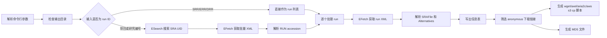
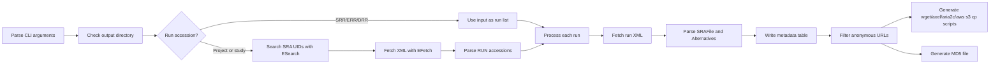

# NCBI SRA File Information Downloader

中文 | [English](#english)

`run_get_bioinfor_from_NCBI_SRA.py` is a small Python script for retrieving file metadata from NCBI SRA and generating download helper scripts.

`run_get_bioinfor_from_NCBI_SRA.py` 是一个用于从 NCBI SRA 获取测序文件信息的小型 Python 脚本，并会自动生成下载脚本与 MD5 校验文件。

---

## 中文

### 功能概览

该脚本支持输入单个 SRA run ID，也支持输入 BioProject 或 SRA Study 编号。脚本会调用 NCBI E-utilities 获取 SRA XML，解析其中的 `SRAFile` 和 `Alternatives` 记录，并生成如下文件：

- `*_infor.xls`：run 级文件信息表，实际格式为 UTF-8 TSV。
- `*_run_list.txt`：项目或研究编号解析出的 run 列表。
- `*_all_run_infor.xls`：项目或研究编号下所有 run 的合并信息表。
- `*_download_wget.sh`：使用 `wget` 下载匿名可访问文件。
- `*_download_axel.sh`：使用 `axel` 下载匿名可访问文件。
- `*_download_aria2c.sh`：使用 `aria2c` 下载匿名可访问文件。
- `*_download_aws_s3_cp.sh`：使用 `aws s3 cp --no-sign-request` 下载可转换为 S3 URL 的匿名公开文件。
- `*_download_md5.txt`：下载文件的 MD5 校验清单。

### 环境要求

- Python 3
- 可访问 NCBI E-utilities 的网络环境
- 下载文件时可选安装：`wget`、`axel`、`aria2c` 或 AWS CLI

脚本只依赖 Python 标准库，不需要安装第三方 Python 包。

### 快速开始

```bash
# 查看帮助
python run_get_bioinfor_from_NCBI_SRA.py -h

# 单个 SRA run
mkdir -p download2
python run_get_bioinfor_from_NCBI_SRA.py -i SRR8869110 -o ./download2

# BioProject 项目号
mkdir -p download1
python run_get_bioinfor_from_NCBI_SRA.py -i PRJNA531644 -o ./download1

# SRA Study 编号
python run_get_bioinfor_from_NCBI_SRA.py -i SRP191521 -o ./download1
```

### 参数说明

| 参数 | 是否必需 | 默认值 | 说明 | 示例 |
| --- | --- | --- | --- | --- |
| `-i`, `--input` | 是 | 无 | SRA run、study 或 BioProject ID。run 号通常以 `SRR`、`ERR`、`DRR` 开头。 | `SRR8869110` |
| `-o`, `--output_dir` | 否 | `./` | 输出目录。该目录必须已经存在，脚本不会自动创建。 | `./download1` |

### 使用示例

#### 示例 1：获取单个 run 的文件信息

```bash
mkdir -p download2
python run_get_bioinfor_from_NCBI_SRA.py -i SRR8869110 -o ./download2
```

典型输出：

```text
download2/
├── SRR8869110_infor.xls
├── SRR8869110_download_wget.sh
├── SRR8869110_download_axel.sh
├── SRR8869110_download_aria2c.sh
├── SRR8869110_download_aws_s3_cp.sh
└── SRR8869110_download_md5.txt
```

#### 示例 2：获取项目下所有 run 的文件信息

```bash
mkdir -p download1
python run_get_bioinfor_from_NCBI_SRA.py -i PRJNA531644 -o ./download1
```

典型输出：

```text
download1/
├── PRJNA531644_run_list.txt
├── PRJNA531644_all_run_infor.xls
├── PRJNA531644_download_wget.sh
├── PRJNA531644_download_axel.sh
├── PRJNA531644_download_aria2c.sh
├── PRJNA531644_download_aws_s3_cp.sh
├── PRJNA531644_download_md5.txt
├── SRR8869105_infor.xls
├── SRR8869107_infor.xls
└── ...
```

#### 示例 3：执行下载并校验 MD5

```bash
cd download2
bash SRR8869110_download_wget.sh
md5sum -c SRR8869110_download_md5.txt
```

### 输出文件格式

#### `*_infor.xls` / `*_all_run_infor.xls`

这些文件虽然使用 `.xls` 扩展名，但实际为 Tab 分隔文本文件，可用 Excel、WPS、LibreOffice 或文本编辑器打开。

默认字段如下：

| 字段 | 含义 | 来源 |
| --- | --- | --- |
| `run` | run accession，例如 `SRR8869110`。 | 脚本补充 |
| `cluster` | SRA 文件所在集群或可见范围。 | `SRAFile` 属性 |
| `filename` | 下载后建议保存的文件名。 | `SRAFile` 属性 |
| `size` | 文件大小，单位为字节。 | `SRAFile` 属性 |
| `date` | 文件记录时间。 | `SRAFile` 属性 |
| `md5` | 文件 MD5 值。 | `SRAFile` 属性 |
| `version` | 文件版本。 | `SRAFile` 属性 |
| `semantic_name` | 文件类型描述，例如 `SRA Normalized`、`SRA Lite`。 | `SRAFile` 属性 |
| `supertype` | 文件大类，例如 `Original` 或 `Primary ETL`。 | `SRAFile` 属性 |
| `sratoolkit` | 是否与 SRA Toolkit 相关的标记。 | `SRAFile` 属性 |
| `url` | 下载地址，优先来自 `Alternatives`。 | `Alternatives` 属性 |
| `free_egress` | 免费出口范围，例如 `worldwide` 或 `s3.us-east-1`。 | `Alternatives` 属性 |
| `access_type` | 访问类型，只有 `anonymous` 且有 URL 的记录会进入下载脚本。 | `Alternatives` 属性 |
| `org` | 文件服务来源，例如 `AWS` 或 `NCBI`。 | `Alternatives` 属性 |

如果 NCBI XML 中出现额外属性，脚本会自动把新字段追加到表格列尾。

#### 信息表部分展示

```text
run	cluster	filename	size	date	md5	version	semantic_name	supertype	sratoolkit	url	free_egress	access_type	org
SRR8869110	public	nash3_possorted_genome_bam.bam	21804220950	2019-04-09 12:09:06	c8ce9fb197c380aa72dd706cd90217c6	1	10X Genomics bam file	Original	0	https://sra-pub-src-1.s3.amazonaws.com/SRR8869110/nash3_possorted_genome_bam.bam.1	worldwide	anonymous	AWS
SRR8869110	public	SRR8869110	8145219414	2019-04-09 12:18:10	680f939eac936b693bcd399e3bc85da5	1	SRA Normalized	Primary ETL	1	https://sra-pub-run-odp.s3.amazonaws.com/sra/SRR8869110/SRR8869110	worldwide	anonymous	AWS
SRR8869110	public	SRR8869110.sralite	6301990886	2020-08-13 18:26:56	97ea5db8d976fb6478d3d27ad79d4a7a	1	SRA Lite	Primary ETL	1	https://sra-downloadb.be-md.ncbi.nlm.nih.gov/sos9/sra-pub-zq-922/SRR008/869/SRR8869110.sralite.1	worldwide	anonymous	NCBI
```

#### `*_run_list.txt`

项目或研究编号解析得到的 run accession，每行一个。

```text
SRR8869105
SRR8869107
SRR8869108
SRR8869109
SRR8869110
SRR9054070
```

#### `*_download_wget.sh`

```bash
#!/usr/bin/env bash
set -euo pipefail

# Download anonymous SRA links for SRR8869110
# Generated by run_get_bioinfor_from_NCBI_SRA.py

# filename: nash3_possorted_genome_bam.bam; semantic_name: 10X Genomics bam file
wget -c -O nash3_possorted_genome_bam.bam https://sra-pub-src-1.s3.amazonaws.com/SRR8869110/nash3_possorted_genome_bam.bam.1
```

#### `*_download_aws_s3_cp.sh`

该脚本仅对可转换为 S3 URL 的匿名公开链接生成命令。例如 `https://bucket.s3.amazonaws.com/path/file` 会转换为 `s3://bucket/path/file`。

```bash
#!/usr/bin/env bash
set -euo pipefail

# Download anonymous SRA links for SRR8869110
# Generated by run_get_bioinfor_from_NCBI_SRA.py

# filename: nash3_possorted_genome_bam.bam; semantic_name: 10X Genomics bam file
[[ -f ./nash3_possorted_genome_bam.bam.1 ]] || aws s3 cp --no-sign-request s3://sra-pub-src-1/SRR8869110/nash3_possorted_genome_bam.bam.1 ./
```

#### `*_download_md5.txt`

```text
c8ce9fb197c380aa72dd706cd90217c6  nash3_possorted_genome_bam.bam
680f939eac936b693bcd399e3bc85da5  SRR8869110
97ea5db8d976fb6478d3d27ad79d4a7a  SRR8869110.sralite
```

### 单条记录 JSON 视图

脚本实际输出为 TSV。下面用 pretty JSON 展示同一条记录，便于理解字段含义。

```json
{
  "run": "SRR8869110",
  "cluster": "public",
  "filename": "nash3_possorted_genome_bam.bam",
  "size": "21804220950",
  "date": "2019-04-09 12:09:06",
  "md5": "c8ce9fb197c380aa72dd706cd90217c6",
  "version": "1",
  "semantic_name": "10X Genomics bam file",
  "supertype": "Original",
  "sratoolkit": "0",
  "url": "https://sra-pub-src-1.s3.amazonaws.com/SRR8869110/nash3_possorted_genome_bam.bam.1",
  "free_egress": "worldwide",
  "access_type": "anonymous",
  "org": "AWS"
}
```

### 脚本流程



### 函数概览

| 函数 | 功能 |
| --- | --- |
| `parse_args()` | 解析命令行参数。 |
| `fetch_url()` | 请求远程 URL，支持重试和超时。 |
| `check_output_dir()` | 检查输出路径是否存在且为目录。 |
| `fetch_sra_xml()` | 获取单个 run 的 SRA XML。 |
| `search_sra_uids()` | 搜索项目或研究编号对应的 SRA UID。 |
| `fetch_sra_xml_by_uids()` | 批量获取 UID 对应的 SRA XML。 |
| `parse_run_accessions()` | 从 XML 中解析 `SRR`、`ERR`、`DRR` accession。 |
| `resolve_input_to_runs()` | 将用户输入统一解析为 run 列表。 |
| `parse_sra_files()` | 解析 `SRAFile` 与 `Alternatives` 文件记录。 |
| `read_table()` | 读取已有 TSV 信息表。 |
| `write_table()` | 写出 TSV 信息表。 |
| `merge_columns()` | 合并默认列和 XML 中出现的新列。 |
| `get_anonymous_download_rows()` | 筛选匿名可下载记录。 |
| `build_s3_url()` | 将 S3 HTTPS 链接转换为 `s3://` 链接。 |
| `build_download_command()` | 生成 `wget`、`axel`、`aria2c` 或 `aws s3 cp` 下载命令。 |
| `write_download_scripts()` | 写出多种下载脚本。 |
| `write_md5_file()` | 写出 MD5 校验文件。 |
| `process_run()` | 处理单个 run 的完整流程。 |
| `write_run_list()` | 写出项目或研究编号解析出的 run 列表。 |
| `write_project_outputs()` | 写出项目级合并结果、下载脚本和 MD5 文件。 |
| `main()` | 脚本主流程。 |

### Git 提交说明

仓库中的 `.gitignore` 已加入以下规则：

```gitignore
AGENTS.md
```

因此执行 `git add .` 或提交仓库内容时，根目录下的 `AGENTS.md` 不会被加入版本控制。推荐提交前检查：

```bash
git status --short
git check-ignore -v AGENTS.md
```

如果本地 Git 因仓库所有权提示 `dubious ownership`，可在命令中临时指定当前仓库为安全目录：

```bash
git -c safe.directory='<REPO_ROOT>' status --short
```

### 注意事项

- 输出目录必须已经存在，脚本不会自动创建目录。
- `*_infor.xls` 和 `*_all_run_infor.xls` 是 TSV 文本，不是真正的二进制 Excel 文件。
- 下载脚本只包含 `access_type == "anonymous"` 且存在 `url` 的记录；AWS S3 下载脚本还要求 URL 是 `s3://` 或 `*.s3.amazonaws.com` 格式。
- 如果某个 `{RUN}_infor.xls` 已存在，脚本会跳过重新抓取该 run，并基于已有表格重新生成下载脚本和 MD5 文件。
- 项目或研究编号可能包含大量 run，运行时间和输出文件数量会随之增加。
- 下载数据可能很大，执行下载脚本前请确认磁盘空间和网络稳定性。
- Windows PowerShell 可以运行 Python 脚本；生成的 `.sh` 文件建议在 Git Bash、WSL、Linux 或 macOS 环境执行。

### 常见问题

#### `Output directory does not exist`

输出目录不存在。先创建目录：

```bash
mkdir -p download1
```

#### `No SRA records found`

输入 ID 可能拼写错误，或 NCBI SRA 中没有对应记录。请检查编号前缀和完整数字。

#### 下载脚本为空或命令很少

脚本只导出匿名可访问链接。如果 XML 中主要是云身份或受限访问链接，下载脚本会相应减少。

#### MD5 校验失败

优先检查下载是否中断、文件名是否被改动、是否有旧文件残留。可删除失败文件后重新执行下载脚本。

---

## English

### Overview

This script accepts either a single SRA run accession or a BioProject / SRA Study accession. It queries NCBI E-utilities, parses `SRAFile` and `Alternatives` records from SRA XML, and generates metadata tables, download scripts, and MD5 checksum files.

Generated files include:

- `*_infor.xls`: run-level file metadata table. The actual format is UTF-8 TSV.
- `*_run_list.txt`: run accession list resolved from a project or study accession.
- `*_all_run_infor.xls`: merged metadata table for all runs in a project or study.
- `*_download_wget.sh`: download script using `wget`.
- `*_download_axel.sh`: download script using `axel`.
- `*_download_aria2c.sh`: download script using `aria2c`.
- `*_download_aws_s3_cp.sh`: download script using `aws s3 cp --no-sign-request` for public S3-compatible URLs.
- `*_download_md5.txt`: MD5 checksum list for downloadable files.

### Requirements

- Python 3
- Network access to NCBI E-utilities
- Optional download tools: `wget`, `axel`, `aria2c`, or AWS CLI

The script uses only the Python standard library.

### Quick Start

```bash
# Show help
python run_get_bioinfor_from_NCBI_SRA.py -h

# Single SRA run
mkdir -p download2
python run_get_bioinfor_from_NCBI_SRA.py -i SRR8869110 -o ./download2

# BioProject accession
mkdir -p download1
python run_get_bioinfor_from_NCBI_SRA.py -i PRJNA531644 -o ./download1

# SRA Study accession
python run_get_bioinfor_from_NCBI_SRA.py -i SRP191521 -o ./download1
```

### Arguments

| Argument | Required | Default | Description | Example |
| --- | --- | --- | --- | --- |
| `-i`, `--input` | Yes | None | SRA run, SRA study, or BioProject accession. Run accessions usually start with `SRR`, `ERR`, or `DRR`. | `SRR8869110` |
| `-o`, `--output_dir` | No | `./` | Output directory. The directory must already exist. | `./download1` |

### Examples

#### Example 1: Retrieve metadata for one run

```bash
mkdir -p download2
python run_get_bioinfor_from_NCBI_SRA.py -i SRR8869110 -o ./download2
```

Typical outputs:

```text
download2/
├── SRR8869110_infor.xls
├── SRR8869110_download_wget.sh
├── SRR8869110_download_axel.sh
├── SRR8869110_download_aria2c.sh
├── SRR8869110_download_aws_s3_cp.sh
└── SRR8869110_download_md5.txt
```

#### Example 2: Retrieve metadata for all runs under a project

```bash
mkdir -p download1
python run_get_bioinfor_from_NCBI_SRA.py -i PRJNA531644 -o ./download1
```

Typical outputs:

```text
download1/
├── PRJNA531644_run_list.txt
├── PRJNA531644_all_run_infor.xls
├── PRJNA531644_download_wget.sh
├── PRJNA531644_download_axel.sh
├── PRJNA531644_download_aria2c.sh
├── PRJNA531644_download_aws_s3_cp.sh
├── PRJNA531644_download_md5.txt
├── SRR8869105_infor.xls
├── SRR8869107_infor.xls
└── ...
```

#### Example 3: Download files and verify MD5 checksums

```bash
cd download2
bash SRR8869110_download_wget.sh
md5sum -c SRR8869110_download_md5.txt
```

### Output File Formats

#### `*_infor.xls` / `*_all_run_infor.xls`

These files use an `.xls` extension, but they are UTF-8 tab-separated text files.

Default columns:

| Column | Meaning | Source |
| --- | --- | --- |
| `run` | Run accession, for example `SRR8869110`. | Added by script |
| `cluster` | SRA file cluster or visibility scope. | `SRAFile` attribute |
| `filename` | Suggested local filename. | `SRAFile` attribute |
| `size` | File size in bytes. | `SRAFile` attribute |
| `date` | File record timestamp. | `SRAFile` attribute |
| `md5` | MD5 checksum. | `SRAFile` attribute |
| `version` | File version. | `SRAFile` attribute |
| `semantic_name` | File type description, such as `SRA Normalized` or `SRA Lite`. | `SRAFile` attribute |
| `supertype` | File category, such as `Original` or `Primary ETL`. | `SRAFile` attribute |
| `sratoolkit` | SRA Toolkit related flag. | `SRAFile` attribute |
| `url` | Download URL, preferably from `Alternatives`. | `Alternatives` attribute |
| `free_egress` | Free egress scope, such as `worldwide` or `s3.us-east-1`. | `Alternatives` attribute |
| `access_type` | Access type. Only `anonymous` records with a URL are exported to download scripts. | `Alternatives` attribute |
| `org` | File service provider, such as `AWS` or `NCBI`. | `Alternatives` attribute |

If additional attributes appear in the NCBI XML, the script appends them as extra columns.

#### Metadata table excerpt

```text
run	cluster	filename	size	date	md5	version	semantic_name	supertype	sratoolkit	url	free_egress	access_type	org
SRR8869110	public	nash3_possorted_genome_bam.bam	21804220950	2019-04-09 12:09:06	c8ce9fb197c380aa72dd706cd90217c6	1	10X Genomics bam file	Original	0	https://sra-pub-src-1.s3.amazonaws.com/SRR8869110/nash3_possorted_genome_bam.bam.1	worldwide	anonymous	AWS
SRR8869110	public	SRR8869110	8145219414	2019-04-09 12:18:10	680f939eac936b693bcd399e3bc85da5	1	SRA Normalized	Primary ETL	1	https://sra-pub-run-odp.s3.amazonaws.com/sra/SRR8869110/SRR8869110	worldwide	anonymous	AWS
SRR8869110	public	SRR8869110.sralite	6301990886	2020-08-13 18:26:56	97ea5db8d976fb6478d3d27ad79d4a7a	1	SRA Lite	Primary ETL	1	https://sra-downloadb.be-md.ncbi.nlm.nih.gov/sos9/sra-pub-zq-922/SRR008/869/SRR8869110.sralite.1	worldwide	anonymous	NCBI
```

#### `*_run_list.txt`

One run accession per line:

```text
SRR8869105
SRR8869107
SRR8869108
SRR8869109
SRR8869110
SRR9054070
```

#### `*_download_wget.sh`

```bash
#!/usr/bin/env bash
set -euo pipefail

# Download anonymous SRA links for SRR8869110
# Generated by run_get_bioinfor_from_NCBI_SRA.py

# filename: nash3_possorted_genome_bam.bam; semantic_name: 10X Genomics bam file
wget -c -O nash3_possorted_genome_bam.bam https://sra-pub-src-1.s3.amazonaws.com/SRR8869110/nash3_possorted_genome_bam.bam.1
```

#### `*_download_aws_s3_cp.sh`

This script is generated only for anonymous public URLs that can be represented as S3 URLs. For example, `https://bucket.s3.amazonaws.com/path/file` is converted to `s3://bucket/path/file`.

```bash
#!/usr/bin/env bash
set -euo pipefail

# Download anonymous SRA links for SRR8869110
# Generated by run_get_bioinfor_from_NCBI_SRA.py

# filename: nash3_possorted_genome_bam.bam; semantic_name: 10X Genomics bam file
[[ -f ./nash3_possorted_genome_bam.bam.1 ]] || aws s3 cp --no-sign-request s3://sra-pub-src-1/SRR8869110/nash3_possorted_genome_bam.bam.1 ./
```

#### `*_download_md5.txt`

```text
c8ce9fb197c380aa72dd706cd90217c6  nash3_possorted_genome_bam.bam
680f939eac936b693bcd399e3bc85da5  SRR8869110
97ea5db8d976fb6478d3d27ad79d4a7a  SRR8869110.sralite
```

### Pretty JSON View

The actual script output is TSV. The following pretty JSON object shows one equivalent record for readability.

```json
{
  "run": "SRR8869110",
  "cluster": "public",
  "filename": "nash3_possorted_genome_bam.bam",
  "size": "21804220950",
  "date": "2019-04-09 12:09:06",
  "md5": "c8ce9fb197c380aa72dd706cd90217c6",
  "version": "1",
  "semantic_name": "10X Genomics bam file",
  "supertype": "Original",
  "sratoolkit": "0",
  "url": "https://sra-pub-src-1.s3.amazonaws.com/SRR8869110/nash3_possorted_genome_bam.bam.1",
  "free_egress": "worldwide",
  "access_type": "anonymous",
  "org": "AWS"
}
```

### Workflow



### Function Summary

| Function | Purpose |
| --- | --- |
| `parse_args()` | Parse command-line arguments. |
| `fetch_url()` | Fetch a remote URL with retry and timeout handling. |
| `check_output_dir()` | Check whether the output path exists and is a directory. |
| `fetch_sra_xml()` | Fetch SRA XML for one run accession. |
| `search_sra_uids()` | Search SRA UIDs for a project or study accession. |
| `fetch_sra_xml_by_uids()` | Fetch SRA XML by a list of UIDs. |
| `parse_run_accessions()` | Parse `SRR`, `ERR`, and `DRR` accessions from XML. |
| `resolve_input_to_runs()` | Resolve user input to a run accession list. |
| `parse_sra_files()` | Parse `SRAFile` and `Alternatives` file records. |
| `read_table()` | Read an existing TSV metadata table. |
| `write_table()` | Write a TSV metadata table. |
| `merge_columns()` | Merge default columns with new XML attributes. |
| `get_anonymous_download_rows()` | Filter anonymous downloadable records. |
| `build_s3_url()` | Convert an S3 HTTPS URL to an `s3://` URL. |
| `build_download_command()` | Build a `wget`, `axel`, `aria2c`, or `aws s3 cp` command. |
| `write_download_scripts()` | Write multiple download scripts. |
| `write_md5_file()` | Write the MD5 checksum file. |
| `process_run()` | Process one run accession end to end. |
| `write_run_list()` | Write the run list resolved from a project or study accession. |
| `write_project_outputs()` | Write project-level merged outputs and helper files. |
| `main()` | Run the complete workflow. |

### Git Commit Notes

The repository `.gitignore` includes this rule:

```gitignore
AGENTS.md
```

As a result, `AGENTS.md` in this directory will not be staged by `git add .` or included in commits. Recommended checks before committing:

```bash
git status --short
git check-ignore -v AGENTS.md
```

If Git reports `dubious ownership`, use a one-off `safe.directory` option for this repository:

```bash
git -c safe.directory='<REPO_ROOT>' status --short
```

### Notes

- The output directory must already exist.
- `*_infor.xls` and `*_all_run_infor.xls` are TSV text files, not binary Excel files.
- Download scripts include only records where `access_type == "anonymous"` and `url` is present. The AWS S3 script additionally requires a `s3://` or `*.s3.amazonaws.com` URL.
- If `{RUN}_infor.xls` already exists, the script skips fetching that run again and regenerates helper files from the existing table.
- A project or study accession may resolve to many runs, increasing runtime and output size.
- Downloaded data can be large. Check disk space and network stability before running generated download scripts.
- The Python script can run in Windows PowerShell. The generated `.sh` files are intended for Git Bash, WSL, Linux, or macOS.

### Troubleshooting

#### `Output directory does not exist`

Create the output directory before running the script:

```bash
mkdir -p download1
```

#### `No SRA records found`

The input accession may be misspelled, or there may be no matching record in NCBI SRA. Check the accession prefix and digits.

#### The generated download script is empty or contains only a few commands

Only anonymous download URLs are exported. Cloud-identity or restricted-access URLs are skipped.

#### MD5 verification failed

Check whether the download was interrupted, whether filenames were changed, or whether stale files exist. Remove failed files and rerun the download script.
